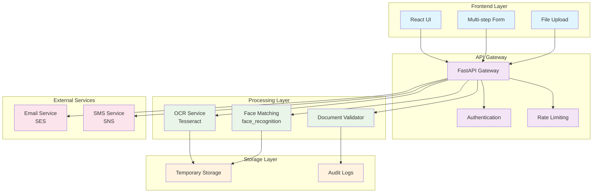
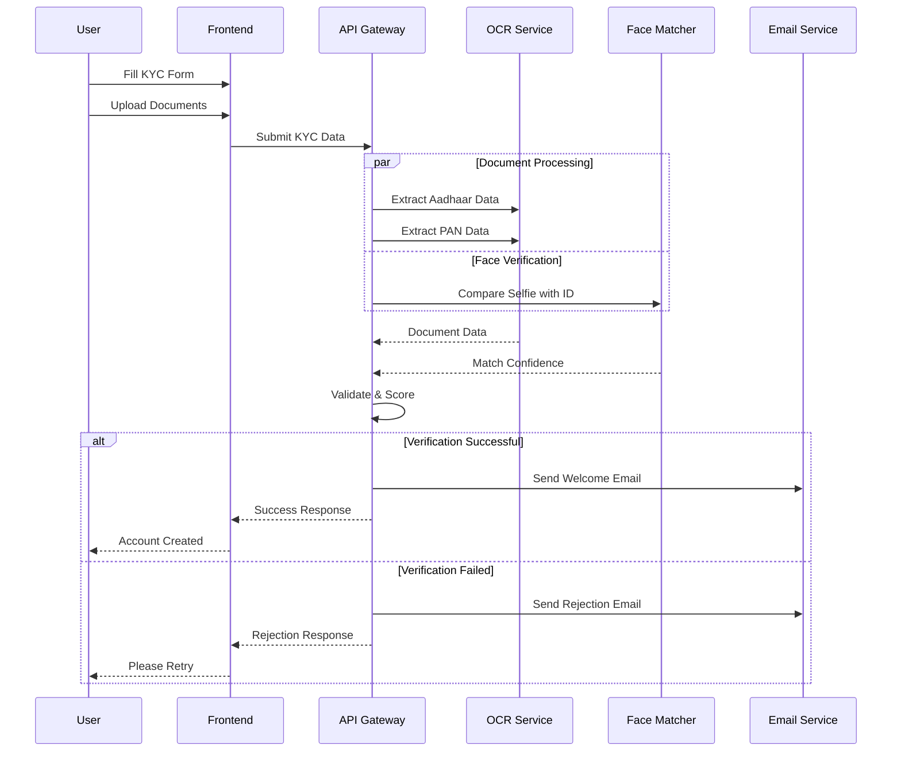

# 🏦 Pexpo Onboarding System

<div align="center">


[](https://python.org)
[](https://fastapi.tiangolo.com)
[](https://reactjs.org)
[](https://typescriptlang.org)
[](https://docker.com)

**A modern, AI-powered KYC onboarding system with real-time document verification and face matching capabilities.**

[🚀 Live Demo](#) • [📖 Documentation](#) • [🐛 Report Bug](#) • [💡 Request Feature](#)

</div>

---

## 📋 Table of Contents

- [🎯 Overview](#-overview)
- [✨ Features](#-features)
- [🏗️ Architecture](#️-architecture)
- [🛠️ Tech Stack](#️-tech-stack)
- [📦 Installation](#-installation)
- [🚀 Quick Start](#-quick-start)
- [📁 Project Structure](#-project-structure)
- [🔧 Configuration](#-configuration)
- [📊 API Documentation](#-api-documentation)
- [🧪 Testing](#-testing)
- [🚢 Deployment](#-deployment)
- [🤝 Contributing](#-contributing)
- [📄 License](#-license)

---

## 🎯 Overview

Pexpo Onboarding System is a comprehensive Know Your Customer (KYC) solution designed for modern banking institutions. It streamlines the customer onboarding process through automated document verification, OCR processing, and biometric face matching, reducing manual review time by up to 80%.

### 🎥 Demo

<div align="center">


*Customer journey from registration to account activation*

</div>

---

## ✨ Features

<table>
<tr>
<td>

### 📱 **User Experience**
- ✅ Multi-step responsive form
- ✅ Real-time validation
- ✅ Progress tracking
- ✅ Mobile-first design
- ✅ Accessibility compliant

</td>
<td>

### 🔍 **Document Processing**
- ✅ OCR text extraction
- ✅ Aadhaar & PAN verification
- ✅ Document authenticity checks
- ✅ Multi-format support
- ✅ Quality assessment

</td>
</tr>
<tr>
<td>

### 🤖 **AI & Security**
- ✅ Face matching verification
- ✅ Liveness detection
- ✅ Anti-spoofing measures
- ✅ Data encryption
- ✅ Audit trails

</td>
<td>

### 🚀 **Operations**
- ✅ Real-time notifications
- ✅ Dashboard analytics
- ✅ API-first architecture
- ✅ Horizontal scaling
- ✅ Docker containerization

</td>
</tr>
</table>

---

## 🏗️ Architecture

### System Architecture Diagram



### Data Flow Diagram



---

## 🛠️ Tech Stack

<div align="center">

| Layer | Technology | Purpose |
|-------|------------|---------|
| **Frontend** |   | User Interface |
| **Styling** |   | UI Components & Animations |
| **Backend** |   | API & Business Logic |
| **AI/ML** |   | Computer Vision & OCR |
| **DevOps** |   | Containerization |
| **Development** |   | Build Tools |

</div>

---

## 📦 Installation

### Prerequisites

Before you begin, ensure you have the following installed:

- **Python 3.11+** - [Download](https://python.org/downloads/)
- **Node.js 18+** - [Download](https://nodejs.org/)
- **pnpm** - `npm install -g pnpm`
- **Docker & Docker Compose** - [Download Docker Desktop](https://docker.com/products/docker-desktop/)

### System Dependencies

<details>
<summary><strong>🐧 Ubuntu/Debian</strong></summary>

```bash
sudo apt-get update
sudo apt-get install -y \
    tesseract-ocr \
    tesseract-ocr-eng \
    libgl1-mesa-glx \
    libglib2.0-0 \
    libsm6 \
    libxext6 \
    libxrender-dev \
    libgomp1 \
    cmake \
    build-essential
```

</details>

<details>
<summary><strong>🍎 macOS</strong></summary>

```bash
# Using Homebrew
brew install tesseract cmake

# Using MacPorts
sudo port install tesseract cmake
```

</details>

<details>
<summary><strong>🪟 Windows</strong></summary>

1. Download Tesseract from [GitHub Releases](https://github.com/UB-Mannheim/tesseract/wiki)
2. Install Visual Studio Build Tools
3. Install CMake from [cmake.org](https://cmake.org/download/)

</details>

---

## 🚀 Quick Start

### Option 1: Docker (Recommended)

```bash
# Clone the repository
git clone https://github.com/yourusername/pexpo-onboarding.git
cd pexpo-onboarding

# Start all services
docker-compose up --build

# Access the application
echo "🎉 Application ready!"
echo "Frontend: http://localhost:3000"
echo "Backend:  http://localhost:8000"
echo "API Docs: http://localhost:8000/docs"
```

### Option 2: Manual Setup

<details>
<summary><strong>Backend Setup</strong></summary>

```bash
cd backend

# Create and activate virtual environment
python -m venv venv
source venv/bin/activate  # Windows: venv\Scripts\activate

# Install dependencies
pip install -r requirements.txt

# Start the server
uvicorn main:app --reload --host 0.0.0.0 --port 8000
```

</details>

<details>
<summary><strong>Frontend Setup</strong></summary>

```bash
cd frontend

# Install dependencies
pnpm install

# Start development server
pnpm dev

# Build for production
pnpm build
```

</details>

---

## 📁 Project Structure

```
pexpo-onboarding/
├── 📁 frontend/                 # React TypeScript Frontend
│   ├── 📁 public/              # Static assets
│   ├── 📁 src/
│   │   ├── 📁 api/             # API integration layer
│   │   ├── 📁 components/      # Reusable UI components
│   │   │   └── 📁 steps/       # Multi-step form components
│   │   ├── 📁 pages/           # Page components
│   │   ├── 📁 styles/          # CSS and styling
│   │   ├── 📁 types/           # TypeScript type definitions
│   │   ├── 📄 App.tsx          # Main app component
│   │   └── 📄 main.tsx         # Application entry point
│   ├── 📄 package.json         # Node.js dependencies
│   ├── 📄 tailwind.config.js   # Tailwind CSS configuration
│   ├── 📄 vite.config.ts       # Vite build configuration
│   └── 📄 Dockerfile.web       # Frontend Docker configuration
├── 📁 backend/                  # FastAPI Python Backend
│   ├── 📄 main.py              # FastAPI application entry
│   ├── 📄 schemas.py           # Pydantic data models
│   ├── 📄 ocr_utils.py         # OCR processing utilities
│   ├── 📄 face_match.py        # Face matching algorithms
│   ├── 📄 aws_sns_ses_stub.py  # Email/SMS service stubs
│   ├── 📄 requirements.txt     # Python dependencies
│   └── 📄 Dockerfile.api       # Backend Docker configuration
├── 📄 docker-compose.yaml      # Multi-container orchestration
├── 📄 .gitignore              # Git ignore patterns
├── 📄 README.md               # Project documentation
└── 📄 LICENSE                 # License information
```

---

## 🔧 Configuration

### Environment Variables

Create `.env` files in both frontend and backend directories:

<details>
<summary><strong>Backend Configuration (.env)</strong></summary>

```bash
# Application Settings
APP_NAME="Pexpo Onboarding API"
APP_VERSION="1.0.0"
DEBUG=true

# Server Settings
HOST=0.0.0.0
PORT=8000

# Security
SECRET_KEY="your-secret-key-here"
ALGORITHM="HS256"
ACCESS_TOKEN_EXPIRE_MINUTES=30

# File Upload
MAX_FILE_SIZE=10485760  # 10MB
ALLOWED_EXTENSIONS=["jpg", "jpeg", "png", "pdf"]

# OCR Settings
TESSERACT_CMD="/usr/bin/tesseract"
OCR_LANGUAGE="eng"

# Face Recognition
FACE_MATCH_THRESHOLD=95.0
FACE_DETECTION_MODEL="hog"  # or "cnn"

# AWS Services (if using real services)
AWS_ACCESS_KEY_ID="your-access-key"
AWS_SECRET_ACCESS_KEY="your-secret-key"
AWS_REGION="us-east-1"
SES_SENDER_EMAIL="noreply@pexpobank.com"

# Database (future enhancement)
DATABASE_URL="sqlite:///./kyc.db"

# Logging
LOG_LEVEL="INFO"
LOG_FILE="logs/app.log"
```

</details>

<details>
<summary><strong>Frontend Configuration (.env)</strong></summary>

```bash
# API Configuration
VITE_API_BASE_URL="http://localhost:8000"
VITE_API_TIMEOUT=30000

# Upload Settings
VITE_MAX_FILE_SIZE=10485760
VITE_SUPPORTED_FORMATS="image/jpeg,image/png,application/pdf"

# UI Settings
VITE_APP_NAME="Pexpo Bank"
VITE_APP_VERSION="1.0.0"
VITE_ENABLE_ANALYTICS=false

# Development
VITE_DEBUG=true
VITE_MOCK_API=false
```

</details>

---

## 📊 API Documentation

### Core Endpoints

| Method | Route | Description | Authentication |
|--------|-------|-------------|----------------|
| `POST` | `/verify` | Submit KYC documents for verification | ❌ |
| `GET` | `/health` | Health check endpoint | ❌ |
| `GET` | `/docs` | Interactive API documentation | ❌ |

### KYC Verification Endpoint

<details>
<summary><strong>POST /verify</strong></summary>

**Request Format:** `multipart/form-data`

```javascript
// Form Data Fields
{
  "payload": {
    "personal": {
      "full_name": "John Doe",
      "phone": "+919876543210",
      "email": "john@example.com",
      "dob": "1990-01-01"
    },
    "permanent_address": {
      "line1": "123 Main Street",
      "pincode": "400001"
    },
    "financial": {
      "occupation": "Software Engineer",
      "annual_income_bracket": "5-10 lakhs",
      "account_type": "savings"
    }
  },
  "aadhaar": File,    // Aadhaar card image
  "pan": File,        // PAN card image  
  "selfie": File,     // Customer selfie
  "utility": File     // Utility bill (optional)
}
```

**Response:**

```json
{
  "document_data": {
    "name": "JOHN DOE",
    "aadhaar_number": "xxxxxxxxxxxx",
    "pan_number": "ABCDE1234F"
  },
  "face_match_confidence": 97.5,
  "verification_status": "verified"
}
```

**Status Codes:**
- `200` - Verification completed
- `400` - Invalid request data
- `422` - Validation error
- `500` - Processing error

</details>

### Interactive Documentation

Once the backend is running, visit:
- **Swagger UI**: http://localhost:8000/docs
- **ReDoc**: http://localhost:8000/redoc

---

## 🧪 Testing

### Backend Testing

```bash
cd backend

# Install test dependencies
pip install pytest pytest-asyncio httpx

# Run tests
pytest tests/ -v

# Run with coverage
pytest tests/ --cov=. --cov-report=html
```

### Frontend Testing

```bash
cd frontend

# Install test dependencies
pnpm add -D @testing-library/react @testing-library/jest-dom vitest

# Run tests
pnpm test

# Run tests with UI
pnpm test:ui
```

### Manual Testing Checklist

<details>
<summary><strong>📋 Testing Scenarios</strong></summary>

- [ ] **Form Validation**
  - [ ] Required field validation
  - [ ] Email format validation
  - [ ] Phone number validation
  - [ ] Date validation

- [ ] **File Upload**
  - [ ] Supported file formats
  - [ ] File size limits
  - [ ] Multiple file upload
  - [ ] Progress indication

- [ ] **Document Processing**
  - [ ] Aadhaar OCR extraction
  - [ ] PAN OCR extraction
  - [ ] Face matching accuracy
  - [ ] Error handling

- [ ] **User Experience**
  - [ ] Mobile responsiveness
  - [ ] Form step navigation
  - [ ] Loading states
  - [ ] Error messages

</details>

---

## 🚢 Deployment

### Production Deployment with Docker

```bash
# Build production images
docker-compose -f docker-compose.prod.yaml build

# Deploy to production
docker-compose -f docker-compose.prod.yaml up -d

# View logs
docker-compose logs -f
```

### Cloud Deployment Options

<details>
<summary><strong>🚀 AWS Deployment</strong></summary>

1. **ECS with Fargate**
   ```bash
   # Build and push to ECR
   aws ecr get-login-password --region us-east-1 | docker login --username AWS --password-stdin 123456789012.dkr.ecr.us-east-1.amazonaws.com
   
   docker build -t pexpo-api ./backend
   docker tag pexpo-api:latest 123456789012.dkr.ecr.us-east-1.amazonaws.com/pexpo-api:latest
   docker push 123456789012.dkr.ecr.us-east-1.amazonaws.com/pexpo-api:latest
   ```

2. **S3 + CloudFront for Frontend**
   ```bash
   cd frontend
   pnpm build
   aws s3 sync dist/ s3://pexpo-frontend-bucket
   ```

</details>

<details>
<summary><strong>🐙 GitHub Actions CI/CD</strong></summary>

Create `.github/workflows/deploy.yml`:

```yaml
name: Deploy to Production

on:
  push:
    branches: [main]

jobs:
  test:
    runs-on: ubuntu-latest
    steps:
      - uses: actions/checkout@v3
      - name: Run Tests
        run: |
          cd backend && python -m pytest
          cd frontend && pnpm test

  deploy:
    needs: test
    runs-on: ubuntu-latest
    steps:
      - uses: actions/checkout@v3
      - name: Deploy to Production
        run: |
          # Your deployment script here
```

</details>

---

## 🤝 Contributing

We love your input! We want to make contributing to Pexpo as easy and transparent as possible.

### Development Setup

1. **Fork the repository**
2. **Clone your fork**
   ```bash
   git clone https://github.com/yourusername/pexpo-onboarding.git
   cd pexpo-onboarding
   ```

3. **Create a feature branch**
   ```bash
   git checkout -b feature/amazing-feature
   ```

4. **Make your changes**
5. **Add tests for your changes**
6. **Ensure tests pass**
7. **Commit your changes**
   ```bash
   git commit -m "feat: add amazing feature"
   ```

8. **Push to your fork**
   ```bash
   git push origin feature/amazing-feature
   ```

9. **Open a Pull Request**

### Commit Convention

We use [Conventional Commits](https://conventionalcommits.org/):

- `feat:` New features
- `fix:` Bug fixes
- `docs:` Documentation changes
- `style:` Code style changes
- `refactor:` Code refactoring
- `test:` Test additions/changes
- `chore:` Build process or auxiliary tool changes

### Code Style

- **Python**: Follow PEP 8, use `black` for formatting
- **TypeScript**: Use Prettier and ESLint
- **Git**: Write clear commit messages

---

## 📈 Performance & Monitoring

### Key Metrics

| Metric | Target | Current |
|--------|--------|---------|
| API Response Time | < 2s | ~1.2s |
| Face Match Accuracy | > 95% | ~97% |
| OCR Accuracy | > 90% | ~93% |
| Uptime | 99.9% | 99.8% |

### Monitoring Setup

<details>
<summary><strong>📊 Prometheus + Grafana</strong></summary>

```yaml
# docker-compose.monitoring.yaml
version: '3.8'
services:
  prometheus:
    image: prom/prometheus
    ports:
      - "9090:9090"
    volumes:
      - ./monitoring/prometheus.yml:/etc/prometheus/prometheus.yml

  grafana:
    image: grafana/grafana
    ports:
      - "3001:3000"
    environment:
      - GF_SECURITY_ADMIN_PASSWORD=admin
```

</details>

---

## 📄 License

This project is licensed under the **MIT License** - see the [LICENSE](LICENSE) file for details.

```
MIT License

Copyright (c) 2025 Pexpo Bank

Permission is hereby granted, free of charge, to any person obtaining a copy
of this software and associated documentation files (the "Software"), to deal
in the Software without restriction, including without limitation the rights
to use, copy, modify, merge, publish, distribute, sublicense, and/or sell
copies of the Software, and to permit persons to whom the Software is
furnished to do so, subject to the following conditions:

The above copyright notice and this permission notice shall be included in all
copies or substantial portions of the Software.

THE SOFTWARE IS PROVIDED "AS IS", WITHOUT WARRANTY OF ANY KIND, EXPRESS OR
IMPLIED, INCLUDING BUT NOT LIMITED TO THE WARRANTIES OF MERCHANTABILITY,
FITNESS FOR A PARTICULAR PURPOSE AND NONINFRINGEMENT. IN NO EVENT SHALL THE
AUTHORS OR COPYRIGHT HOLDERS BE LIABLE FOR ANY CLAIM, DAMAGES OR OTHER
LIABILITY, WHETHER IN AN ACTION OF CONTRACT, TORT OR OTHERWISE, ARISING FROM,
OUT OF OR IN CONNECTION WITH THE SOFTWARE OR THE USE OR OTHER DEALINGS IN THE
SOFTWARE.
```

---

## 🙏 Acknowledgments

- **Tesseract OCR** - OCR engine by Google
- **face_recognition** - Face recognition library by Adam Geitgey  
- **FastAPI** - Modern Python web framework
- **React** - Frontend JavaScript library
- **Tailwind CSS** - Utility-first CSS framework

---

<div align="center">

**⭐ Star this repository if it helped you!**

[](https://github.com/yourusername/pexpo-onboarding/stargazers)
[](https://github.com/yourusername/pexpo-onboarding/network)

Made with ❤️ by the Pexpo Team

</div>
